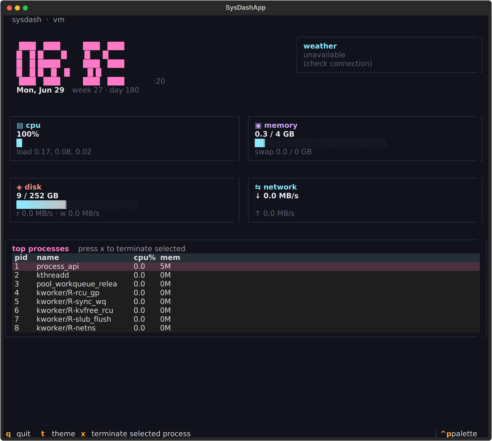

# sysdash

An ambient terminal dashboard — system metrics, a big clock, and the weather, designed to sit in a spare terminal pane all day rather than something you only open when something's wrong.



## Why this exists

Most system monitors (`btop`, `glances`, `gotop`, and friends — all great tools) are diagnostic instruments: you open them to investigate something, then close them. `sysdash` is built for a different habit — the dedicated pane in a tiled terminal that's just *always there*. Because it's meant to be looked at, not just read, it folds in the two things people otherwise tab away to check — the time and the weather — so that pane earns its keep all day, not just when CPU usage spikes.

If you tile your terminal and have a pane you don't quite know what to do with, this is for that pane.

## Features

- **3-second startup animation** — a Matrix-style code-rain intro in magenta/aqua, easing straight into the dashboard (skip it with `--no-splash`)
- **Live system metrics** — CPU (with per-tick sparkline history), memory, disk usage + I/O throughput, network throughput, rendered with smooth aqua-to-coral gradient fill bars
- **A clock that actually looks like a clock** — large block-character digits, plus date, ISO week number, and day-of-year
- **Weather** — current conditions via [wttr.in](https://wttr.in) (no API key, no signup)
- **Top processes** — sortable by CPU usage, magenta selection highlight, with the option to terminate a selected process from the UI
- **Five built-in themes** — Premium (deep slate + magenta/aqua), Catppuccin Mocha, Nord, Gruvbox, Dracula — cycle through them with one keypress
- **Optional Nerd Font icons** — plain-Unicode glyphs by default (render everywhere); pass `--nerd-fonts` if your terminal font has Nerd Fonts patched in
- Cross-platform: Linux, macOS, and Windows (Windows Terminal / PowerShell 7+ recommended for full visual fidelity)
- Clean shutdown on Ctrl+C — terminal cursor and screen buffer are always restored

## Install

```bash
pip install sysdash   # once published — see "Run from source" below until then
```

## Run from source

```bash
git clone https://github.com/your-username/sysdash.git
cd sysdash
pip install -e .
sysdash
```

## Usage

```bash
sysdash                          # auto-detects location for weather by IP
sysdash --location "Berlin"      # set weather location explicitly
sysdash --theme nord             # start with a specific theme (premium is default)
sysdash --no-splash              # skip the startup code-rain animation
sysdash --nerd-fonts             # use Nerd Font glyphs instead of plain Unicode
```

| Key | Action |
|-----|--------|
| `q` | Quit |
| `t` | Cycle theme |
| `x` | Terminate the selected process (when the process panel is focused) |
| `tab` | Move focus between panels |

## Requirements

- Python 3.9+
- A terminal with true-color and Unicode box-drawing support for the full visual experience. Modern terminals (Windows Terminal, iTerm2, kitty, alacritty, gnome-terminal, etc.) all work well. Legacy `cmd.exe` works but renders more plainly.

## How it's built

- [`textual`](https://github.com/Textualize/textual) for the UI framework
- [`psutil`](https://github.com/giampaolo/psutil) for system metrics
- [`wttr.in`](https://wttr.in) for weather, queried directly over HTTP — no API key required

## Project layout

```
src/sysdash/
  app.py              # main Textual App, layout, refresh loop, keybindings
  metrics.py          # psutil-based system metric collection
  weather.py          # wttr.in fetching
  sparkline.py        # Unicode sparkline rendering helper
  glyphs.py           # section icon glyphs (plain-Unicode + Nerd Font variants)
  themes/__init__.py  # color theme definitions + gradient interpolation
  widgets/
    clock.py          # big block-digit clock widget
    coderain.py       # startup splash screen (Matrix-style code rain)
    metric_panel.py   # reusable sparkline/gradient-bar metric panels
    weather_panel.py  # weather display widget
    process_panel.py  # top-processes table with kill support
```

## Roadmap ideas

Things that would make good follow-up PRs if you want to extend this:
- Docker container resource usage panel
- Open ports / listening services panel
- Per-core CPU breakdown view
- Config file support (`~/.config/sysdash/config.toml`) for default theme/location instead of CLI flags
- Alternate weather provider (OpenWeatherMap) behind a flag, for people who want more reliability than a free public API offers

## License

MIT — see [LICENSE](LICENSE).
